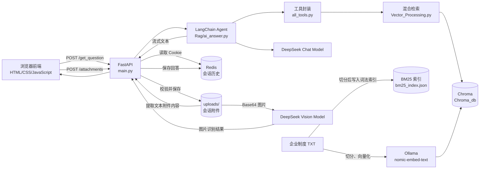
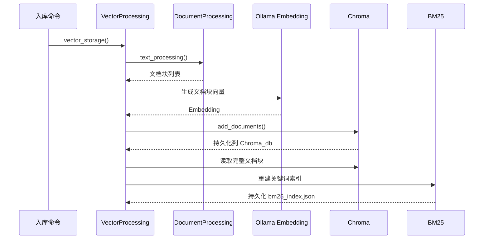
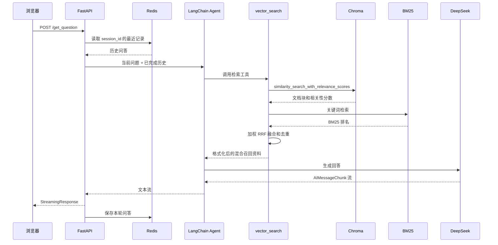
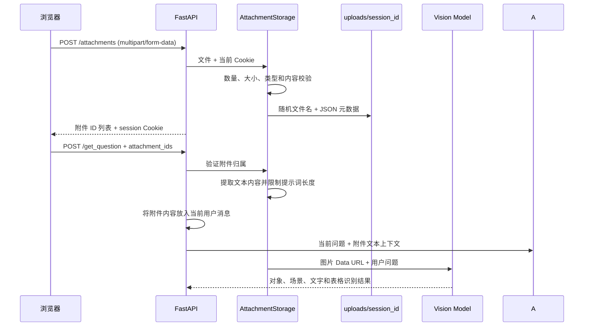

# Company Agent 项目架构

## 1. 文档目的

本文档描述 `company_agent` 当前版本的系统边界、模块职责、数据流、运行依赖和关键技术决策，作为后续开发、评审和维护的基础。

当前系统是一个面向企业制度资料问答的模块化单体原型。本文档区分“当前已实现”和“后续规划”，避免架构文档与代码状态不一致。

## 2. 项目目标

项目目标是构建一个能够回答企业制度相关问题的内部知识助手：

- 从企业制度文本中建立可检索的知识库。
- 根据用户问题召回相关制度片段。
- 由 Agent 判断并调用知识库检索工具。
- 使用大语言模型生成基于资料的回答。
- 保留同一浏览器会话中的最近对话上下文。
- 通过流式响应改善前端等待体验。

当前项目主要用于验证 RAG、Agent 工具调用和会话历史链路，不是生产环境架构。

## 3. 当前架构总览



### 3.1 部署形态

当前为单进程模块化单体：

- FastAPI 负责 HTTP 接口、Cookie 和静态前端。
- 对话附件保存在本机 `uploads/<session_id>/`，由随机 ID 标识。
- LangChain Agent、检索工具和会话逻辑在同一 Python 进程中运行。
- Chroma 使用本地持久化目录 `Chroma_db/`。
- Redis 作为独立服务运行，默认地址为 `localhost:6379`。
- Ollama 作为本地 Embedding 服务运行。
- `deepseek-v4-pro` 负责 Agent、工具调用和最终回答；`deepseek-v4-flash-vision-exp` 负责图片识别。

当前没有独立 Worker、消息队列、对象存储、用户认证服务或容器编排配置。附件保存在本机文件系统，提问时由后端提取文本；图片先进入视觉模型，识别结果再传给 Agent。附件不会写入 RAG 向量库。

## 4. 模块职责

### 4.1 API 层：`main.py`

职责：

- 创建 FastAPI 应用。
- 挂载 `frontend/` 静态资源。
- 提供 `POST /get_question` 问答接口。
- 提供 `POST /attachments` 上传接口和 `DELETE /attachments/{attachment_id}` 删除接口。
- 提供 `POST /new_chat` 新建会话接口。
- 从 `chat_session_id` Cookie 读取和写回会话 ID。
- 将 Agent 结果封装为 `StreamingResponse`。
- 验证提问引用的附件属于当前浏览器会话。
- 提取已授权的文本类附件，并将结果作为当前用户消息的一部分传给 Agent。

不负责：

- 知识库文档解析和向量入库。
- 知识库附件入库。
- 直接操作 Redis 数据结构。

### 4.2 附件处理层：`Attachment_Processing/`

职责：

- 限制每次最多上传 5 个附件、单文件最大 10 MB。
- 支持 PNG、JPEG、WebP、PDF、DOCX、XLSX、TXT、MD 和 CSV。
- 校验扩展名、MIME、文件头、Office ZIP 容器结构和 UTF-8 文本。
- 使用随机附件 ID，按 `session_id` 隔离保存文件和 JSON 元数据。
- 删除当前会话附件，并验证提问引用的附件归属。
- 从 TXT、MD、CSV、PDF、DOCX、XLSX 提取文本，并限制拼接到提示词的长度。
- 对图片返回明确的不可识别说明，不读取图片像素。
- 使用 Base64 Data URL 将图片发送给 `IMAGE_MODEL`，提取视觉模型返回的文字描述。

当前模块负责安全接收、保存、读取已授权文件、文本提取和图片识别。文档文本与视觉结果会拼接到当前用户提示词，但不会写入向量库。

### 4.3 文档处理层：`Document_Processing/Document_Processing.py`

当前职责：

- 使用 `TextLoader` 读取 UTF-8 TXT 文件。
- 使用 `RecursiveCharacterTextSplitter` 切分文本。
- 通过 `chunk_size` 和 `chunk_overlap` 控制切分结果。

当前只支持 TXT。PDF、Word、Excel、Markdown、图片 OCR 和视觉模型解析属于后续扩展。

### 4.4 混合检索层：`Vector_Processing/Vector_Processing.py` 与 `bm25.py`

职责：

- 初始化 Chroma 集合 `Commpany_Vector`。
- 使用 Ollama `nomic-embed-text` 生成 Embedding。
- 将文档块写入 `Chroma_db/`。
- 根据问题执行 Chroma 向量相似度检索和 BM25 关键词检索。
- 使用 `vector_k`、`bm25_k` 获取两路候选结果。
- 使用 `relevance_threshold` 过滤低相关性结果。
- 使用加权 Reciprocal Rank Fusion（RRF）合并两路排名，并按正文、来源和页码去重。
- 将 BM25 索引持久化为 `Chroma_db/bm25_index.json`；服务启动时从 Chroma 重新同步，避免词法索引与向量库不一致。

当前入库由 `vector_storage()` 方法触发，没有对应的知识库入库 HTTP 接口。对话附件接口不触发该方法。入库 ID 使用从 `0` 开始的固定序号，重复入库和文档更新的幂等性仍需改进。

### 4.5 Agent 层：`Rag/ai_answer.py`

职责：

- 创建 LangChain Agent。
- 注册 `vector_search` 工具。
- 将 Redis 中最近的已完成对话拼接到当前请求。
- 调用 Agent 流式生成回答。
- 过滤和输出 `AIMessageChunk` 文本内容。
- 在流结束后保存本轮问答。

当前 Agent 只有一个工具，尚未实现复杂的任务规划、多工具编排、工具超时和重试策略。

### 4.6 工具层：`all_tools/all_tools.py`

当前提供：

| 工具 | 作用 |
| --- | --- |
| `vector_search` | 同时执行向量和 BM25 召回，使用加权 RRF 融合去重，并把命中文档的来源、页码和正文拼接为文本 |

工具层负责向 Agent 暴露稳定的调用接口，避免 Agent 直接依赖 Chroma 的具体实现。

### 4.7 会话层：`Rag/chat_history.py`

职责：

- 没有 Cookie 时生成新的随机 `session_id`。
- 使用 Redis List 保存问答记录。
- 读取最近 10 条记录。
- 保存回答后裁剪为最近 10 条。
- 设置 48 小时过期时间。

当前会话按浏览器 Cookie 区分，没有用户账户、跨设备同步或长期历史数据库。

### 4.8 配置层

`env.py` 当前集中保存：

- 文档路径
- 文本切分参数
- Chroma 路径
- 检索数量和阈值
- DeepSeek 模型实例
- Cookie 名称和会话过期时间

当前配置集中在 `env.py`。项目开发阶段暂未保留自定义日志代码，待核心功能稳定后再统一设计错误日志、审计日志和运行指标。

当前配置仍包含机器相关绝对路径，后续应迁移为环境变量或基于项目根目录的路径。

## 5. 核心数据流

### 5.1 文档入库流程



### 5.2 问答流程



### 5.3 对话附件上传流程



## 6. 数据存储设计

| 数据 | 存储位置 | 生命周期 | 说明 |
| --- | --- | --- | --- |
| 原始制度文本 | `Document_Processing/` | 随项目文件保存 | 当前为单个 UTF-8 TXT |
| 文档块和向量 | `Chroma_db/` | 持久化 | 集合名为 `Commpany_Vector` |
| 会话问答 | Redis List | 48 小时，最多 10 条 | Key 为 Cookie 中的 `session_id` |
| 对话附件 | `uploads/<session_id>/` | 当前未自动过期 | 原文件使用随机 ID 命名，并保存 JSON 元数据 |

当前没有保存文档版本、内容哈希、用户权限标签、文档页码标准化字段或独立的文档元数据库。

## 7. 接口设计

### `POST /attachments`

- 接收字段名为 `files` 的 `multipart/form-data`。
- 每次 1 至 5 个附件，单文件最大 10 MB。
- 成功返回附件 ID、原始文件名、MIME、大小和扩展名，并写回会话 Cookie。
- 任一文件校验失败时，本批次已保存的附件会回滚，返回 `400`。

### `DELETE /attachments/{attachment_id}`

- 只允许删除当前 Cookie 会话拥有的附件。
- 成功返回 `204`；不存在或不属于当前会话时返回 `404`。

### `POST /get_question`

请求：

```json
{
  "question": "请查看附件",
  "attachment_ids": ["32位随机附件ID"]
}
```

行为：

1. 校验问题长度至少为 1。
2. 从 `chat_session_id` Cookie 获取会话，并验证附件归属。
3. 提取文档文本，使用视觉模型识别图片，并将两类结果拼接到当前用户消息后调用 Agent。
4. 以 `text/plain; charset=utf-8` 流式返回。
5. 将最终会话 ID 写回 Cookie。

### `POST /new_chat`

行为：

- 删除浏览器中的 `chat_session_id` Cookie。
- 返回 `204 No Content`。
- 当前不会立即删除 Redis 中旧会话，旧会话由 Redis 过期策略清理。

## 8. 关键技术决策

### 8.1 采用模块化单体

当前项目规模较小，模块化单体可以降低部署和调试成本，同时保留文档处理、检索、Agent 和会话模块的边界。只有在并发量、团队规模或任务耗时明显增加后，才考虑拆分 Worker 或独立服务。

### 8.2 Chroma 作为本地向量库

Chroma 便于本地持久化和快速验证 RAG 流程。当前适合单机原型，不代表已经满足高并发、分布式部署、细粒度权限和高可用要求。

### 8.3 Redis 保存短期对话上下文

Redis List 适合保存有限长度的短期上下文，读取和裁剪逻辑简单。长期历史、用户级会话和审计记录不应只依赖当前 Redis 设计。

### 8.4 流式返回

使用 `StreamingResponse` 将模型生成的文本逐步返回前端，降低首字延迟。当前在客户端中断时可能保存 `completed=false` 的记录，后续需要完善取消、重试和幂等策略。

## 9. 当前风险和限制

- `env.py` 使用绝对路径，跨机器运行需要手工修改。
- 当前已有向量 + BM25 混合检索和结果去重，但没有查询改写、Rerank 和权限过滤。
- 文档入库使用固定序号 ID，重复入库可能导致数据覆盖或重复。
- Agent 只有一个检索工具，尚未支持数据库查询、文件解析和计算工具。
- 对话附件尚未自动过期，也尚未接入恶意文件扫描；视觉结果可能存在误识别，关键字段仍需人工核对。
- 接口返回纯文本，检索来源没有作为结构化字段独立返回。
- Redis 会话只有 48 小时有效，且只保留最近 10 条记录。
- 当前没有身份认证、文档权限过滤、速率限制和审计系统。
- 原始企业资料和 Chroma 数据目录需要纳入备份与访问控制。
- DeepSeek 和 Ollama 是外部运行依赖，任一服务不可用都会影响问答。

## 10. 后续演进路线

### 阶段一：工程基础

- 用环境变量替代绝对路径和硬编码模型配置。
- 增加 `.env.example`、启动检查和依赖服务健康检查。
- 为文档处理、检索、会话和 API 增加单元测试与接口测试。

### 阶段二：RAG 质量

- 完善扫描件 OCR、表格结构化提取和低置信度人工确认。
- 保存文档来源、章节、页码、版本和内容哈希。
- 在现有混合检索基础上增加 Query Rewrite、Rerank 和离线评测。
- 返回结构化引用，并建立 Recall@k、命中率和引用正确率评测集。

### 阶段三：Agent 能力

- 增加数据库查询、文件解析、计算等受控工具。
- 为工具统一参数校验、超时、重试和错误格式。
- 记录 Agent 决策、工具调用链和每一步耗时。

### 阶段四：生产化

- 增加用户认证和文档权限过滤。
- 核心功能稳定后统一增加错误日志、审计日志和运行指标。
- 将大文件解析迁移到异步任务或 Worker。
- 根据规模评估对象存储、独立向量服务和高可用 Redis。
- 增加 Docker、CI、监控、备份和灾难恢复方案。

## 11. 架构验收标准

每次重要改动至少检查：

- 模块职责是否仍然清晰，是否出现跨层直接访问。
- 文档入库是否可重复执行且不会产生不可控重复数据。
- 检索结果是否能够追溯到源文档。
- Agent 工具是否有明确输入、输出和失败行为。
- 会话是否只拼接有效记录，是否受长度限制。
- 流式中断、模型失败和 Redis 不可用时是否有可观察错误。
- README 与本文档是否同步更新。
